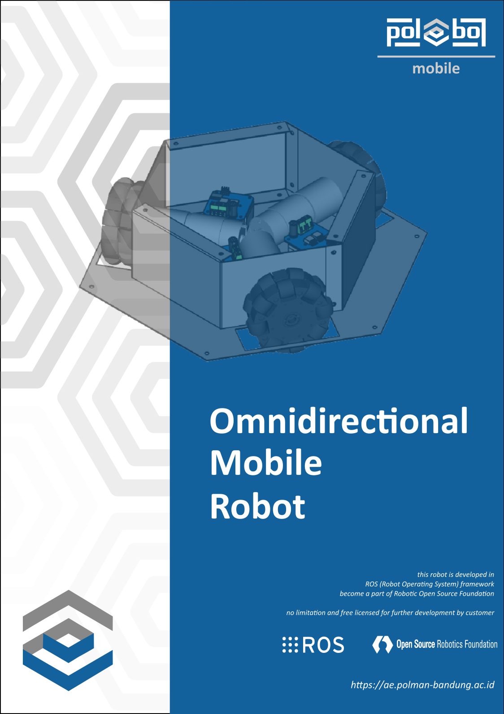
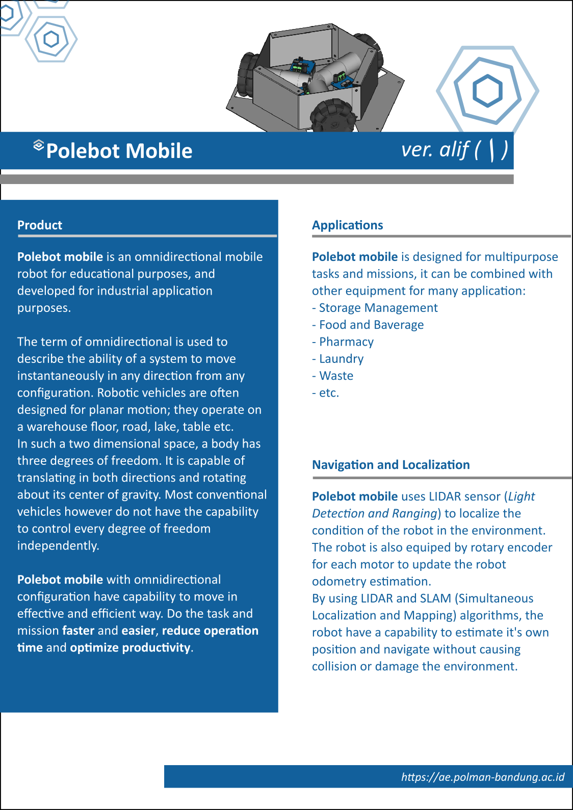
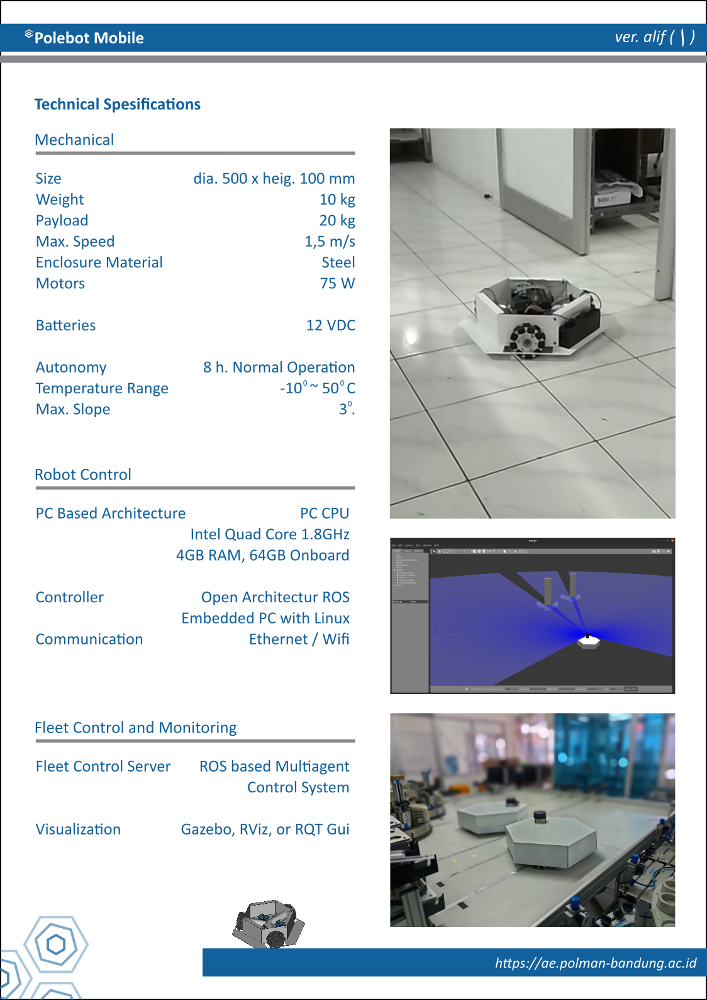
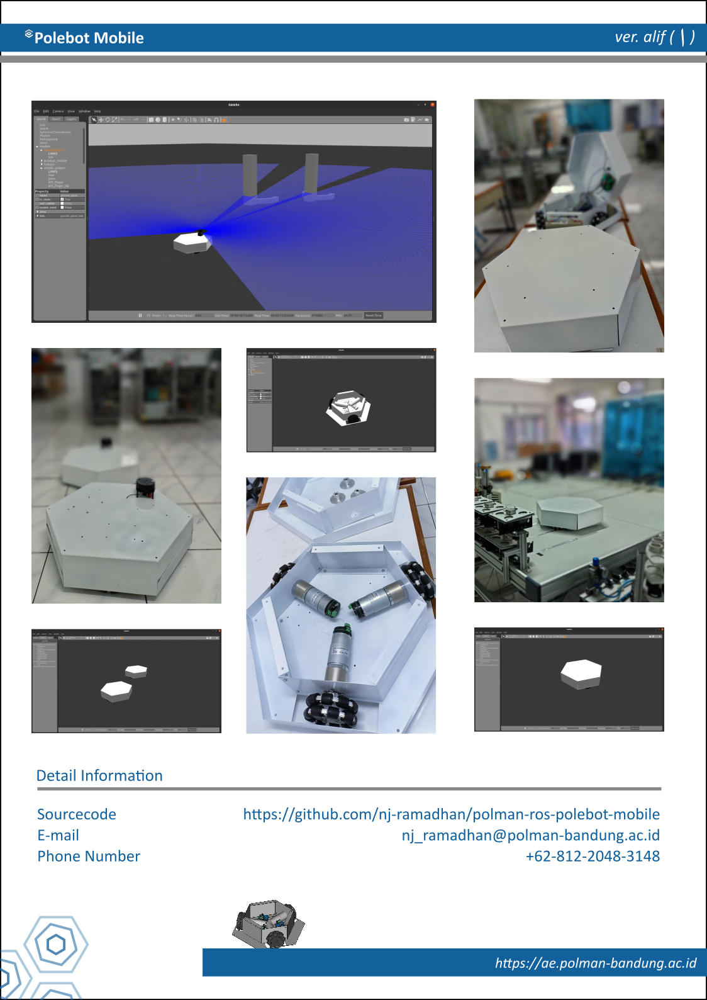

# polman-ros-polebot-mobile
Developed at Robotics Laboratory in Bandung Polytechnic for Manufactruing (POLMAN), West Java, Indonesia

# how to use the code
put the entire folder and files in src folder of the workspace,
then build the project automatically with catkin_make

# change to the original code
Copied from the original ros-dobot repository, 
added a subscriber for moving the robot and a new node for publishing points for the Inverse Kinematics.
updated for control ang visualize multiple Dobot Magician working together.

